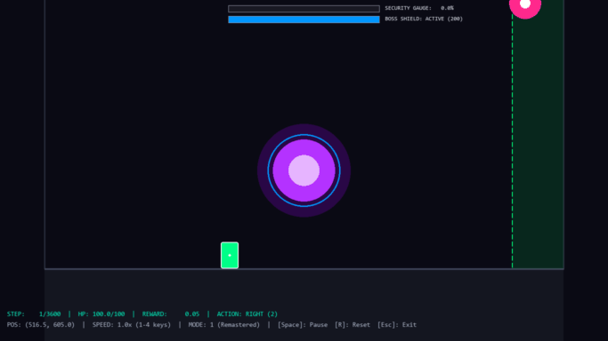
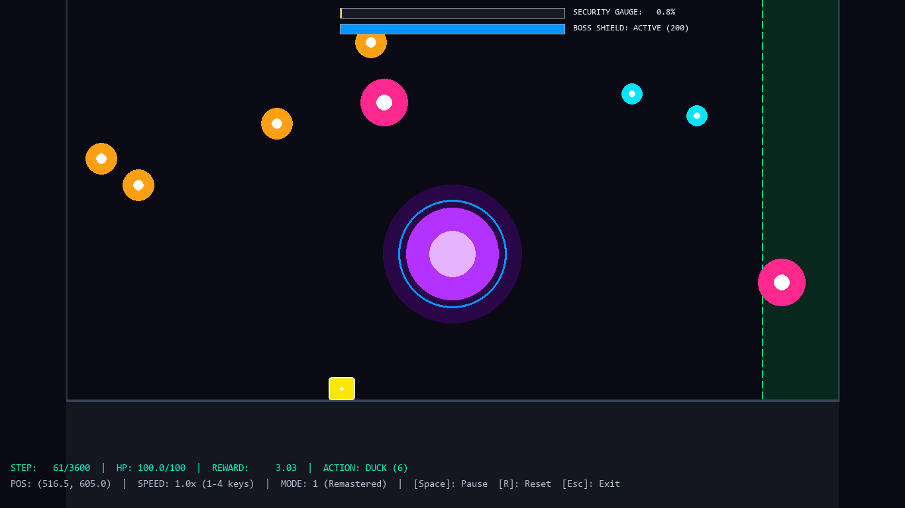

<div align="center">

# Maple-Gymnax (Project Yunseolhwa)

**High-Performance Functional Reinforcement Learning Simulator for MapleStory Lotus Phase 1 on JAX / XLA**

[](https://www.python.org/downloads/)
[](https://github.com/google/jax)
[](https://github.com/RobertTLange/gymnax)
[](https://opensource.org/licenses/MIT)

<br/>

### 🎮 Remastered Mode 1 PPO Agent Gameplay Demo (60 FPS)



*Trained PPO agent dodging dynamic falling debris, navigating tracking lasers, and maintaining survival in Remastered Mode 1.*

</div>

---

## 🌟 Key Features

- **Pure Functional JAX Simulator**:
  - Zero Python control-flow overhead inside the simulation step; 100% vectorized via `jnp.where` and `jax.lax.scan`.
  - Massive parallelism: effortlessly scales to **2,048 ~ 4,096 concurrent environments** on a single machine.
- **Full Mechanics Support**:
  - **Mode 0 (Classic)**: 4-orthogonal rotating cross laser with SAT AABB convex collision mathematics.
  - **Mode 1 (Remastered)**: Security gauge progression, horizontal overload artillery danger zones ($x < 1150$), vertical tracking laser FSM & boss core friendly fire targeting, and electric floor warning/detonation mechanics.
  - **Mode 2 (Hybrid)**: Combines Classic rotating lasers with Remastered boss shield and overload dynamics.
- **Anti-Reward-Hacking Reward Design (v2)**:
  - Strict wall-proximity penalty ($-0.15$/step) to break wall-camping / cowering local minima.
  - Generous Friendly Fire incentives ($+50.0$) and boss shield shatter milestones ($+30.0$).
  - Tracking laser guidance shaping ($+0.08$) guiding agents toward active boss interaction.
- **Interactive Pygame Policy Viewer (`view_policy.py`)**:
  - Real-time 60 FPS neon-aesthetic renderer on $1366 \times 768$ native boss resolution.
  - Zero-stall host state batching via `jax.device_get(state)`, completely eliminating micro-sync bottlenecks.
  - Interactive playback controls: Speed multiplier ($0.5\times \sim 4.0\times$), Pause/Resume, and instant Reset.
- **Chunked Outer Loop Training (`train_ppo.py`)**:
  - 50-update chunked execution with automatic Orbax checkpointing (`step_50`, `step_100`, ...).
  - Fast local CPU training: 300 updates in under 20 minutes (~35,000+ SPS).

---

## 📸 Keyframe Preview



---

## 🚀 Quick Start

### 1. Installation

```bash
# Clone the repository
git clone https://github.com/vibemcpcanvas-del/yunseolhwa.git
cd yunseolhwa

# Create virtual environment and install dependencies
python -m venv .venv
# Windows:
.venv\Scripts\activate
# Linux/macOS:
source .venv/bin/activate

# Install package with development & visualization dependencies
pip install -e ".[dev,viz]"
```

### 2. Run Test Suite

```bash
python -m pytest
# 440 passed in ~90s (100% coverage across Tier 1~4 E2E contracts)
```

### 3. Fast PPO Training (Remastered Mode 1)

```bash
python train_ppo.py --mode 1 --num_envs 2048 --num_steps 64 --update_epochs 2 --num_updates 300 --checkpoint_interval 50
```

Checkpoints will be automatically committed every 50 updates into `checkpoints/mode_1/step_<N>`.

### 4. Interactive Policy Viewer

```bash
# Run trained checkpoint at 60 FPS
python view_policy.py --checkpoint_path checkpoints/mode_1/step_300 --mode 1

# Or test with random policy (dry-run)
python view_policy.py --random --mode 1
```

#### Viewer Controls
| Key | Action |
|:---:|:---|
| `Space` | Toggle Pause / Resume |
| `R` | Force Environment Reset with new PRNG seed |
| `1` | 0.5x Slow-Motion Speed |
| `2` | 1.0x Real-Time (60 FPS) Speed |
| `3` | 2.0x Fast-Forward Speed |
| `4` | 4.0x Ultra-Fast Speed |
| `Esc` | Exit Viewer |

---

## 📂 Repository Structure

```
yunseolhwa/
├── assets/
│   ├── gameplay_demo.gif         # Latest 60 FPS gameplay GIF animation
│   └── gameplay_screenshot.png   # Neon renderer keyframe screenshot
├── src/
│   └── maple_gymnax/
│       ├── envs/
│       │   ├── common.py         # Collision mathematics, SAT projections, action space
│       │   └── lotus_phase1.py   # Pure functional Lotus Phase 1 environment
│       └── wrappers/
│           ├── flatten_obs.py    # Observation flattening wrapper
│           ├── log_wrapper.py    # Branch-free episode metric tracking
│           └── rollout_runner.py # Vectorized JAX scan rollout runner
├── tests/                        # Comprehensive 440-test E2E & unit test suite
├── train_ppo.py                  # High-speed PPO training script (chunked scan)
├── view_policy.py                # 60 FPS Pygame policy viewer
├── eval_checkpoint.py            # Greedy policy quantitative evaluator
├── record_clip.py                # Headless 60 FPS gameplay recorder (GIF/PNG)
├── pyproject.toml                # Project metadata & dependencies
└── .agents/rules/                # JAX/RL development invariants (Rules 1-7)
```

---

## 📜 License

MIT License © 2026 Project Yunseolhwa Authors.
